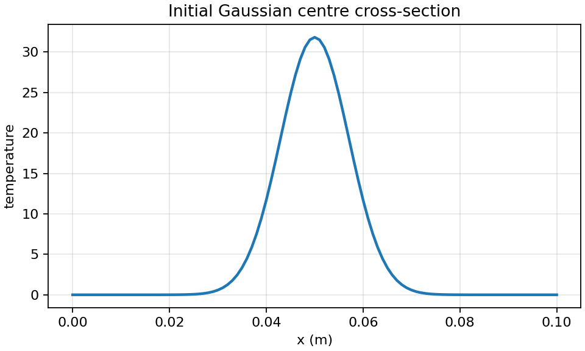
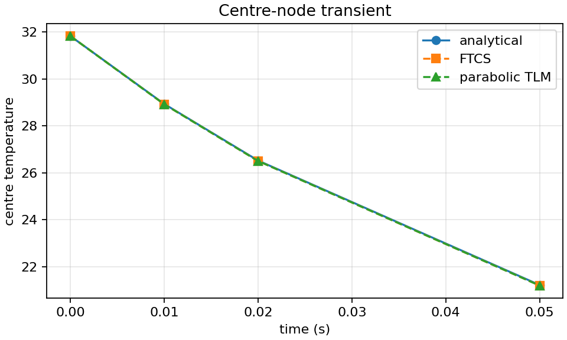
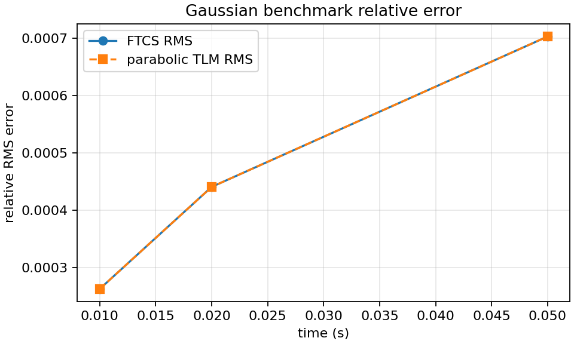
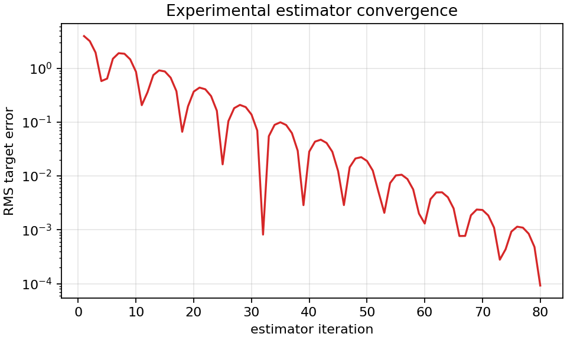
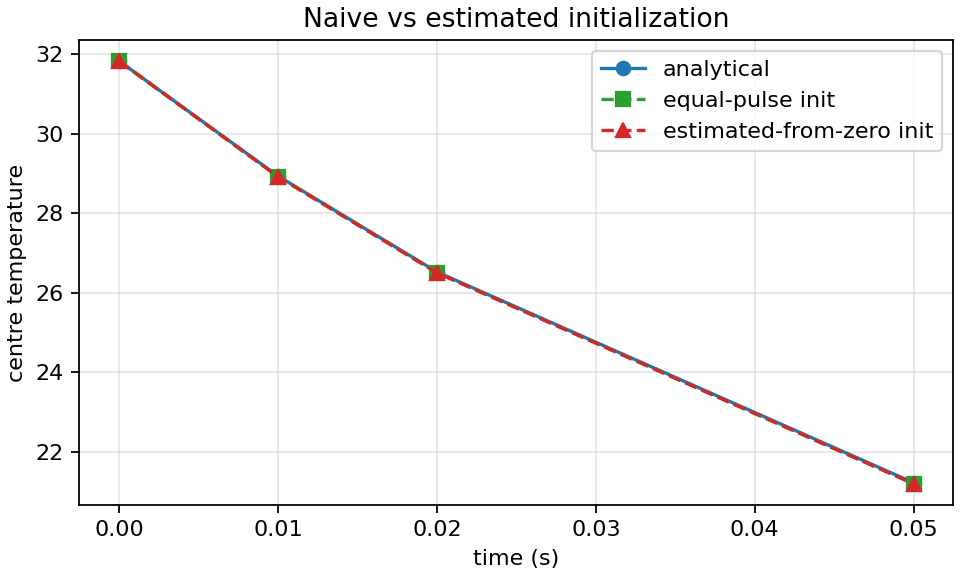

# Koay 2008 Gaussian TLM Diffusion Case Study

This case study is an experimental path toward understanding the parabolic TLM
diffusion and nodal state-estimator work of Koay, Wilkinson and Pulko (2008).
It is not yet a full reproduction of that paper.

The local reference PDF is used for development reading only and is ignored by
Git. Do not commit the PDF.

## Paper Scope

The paper reviews a two-dimensional resistance-loaded TLM heat-transfer
algorithm, then introduces a nodal state estimator intended to reconstruct pulse
states from prescribed temperature fields. The key distinction for TLMpy is that
temperature is an observed nodal potential, while the TLM state is represented by
link and stub pulses.

## Implemented Experimental Node Mapping

The paper's heat-transfer TLM review uses four link pulses plus one stub pulse
per 2D node. The nodal potential is computed from incident link and stub pulses
using weighted admittances. Reflected link and stub pulses are then connected to
neighbouring nodes, while the reflected stub pulse is re-incident on the same
node at the next timestep.

For the parabolic parameterisation, the paper gives:

```text
d = 1 / dl**2
Ys = (specific_heat * density * dl**2) / (thermal_conductivity * dt) - 4
```

A valid implementation must require positive material parameters, positive
spacing and timestep, square spacing for the first 2D case, and `Ys >= 0`.

TLMpy now includes an experimental implementation under
`tlmpy.experimental.parabolic_tlm`. It implements the resistance-free parabolic
link-plus-stub node mapping recorded in
[`docs/derivations/parabolic_tlm_diffusion_koay2008.md`](../derivations/parabolic_tlm_diffusion_koay2008.md):

- four incident link pulse arrays and one incident stub pulse array;
- four reflected link pulse arrays and one reflected stub pulse array;
- nodal temperature derived from incident pulses;
- scattering and explicit non-periodic connection;
- reflective/insulated outer edges for the first case study.

The estimator update described in the paper depends on an estimator parameter
`ld` and requires `ld > 2` for the reported stability region. TLMpy includes an
experimental feedback implementation based on Equations 26 to 28, but this is a
practical mapping rather than a complete root-locus reproduction of the paper.
It must remain under `tlmpy.experimental` until independently reviewed.

## Experimental Benchmark

TLMpy now includes a Stage 1 benchmark:

```bash
python benchmarks/koay2008_gaussian_tlm_diffusion.py
```

This benchmark compares the Gaussian analytical solution used in the paper's
Section 6 with:

1. TLMpy's existing finite-difference diffusion reference solver;
2. the experimental parabolic link-plus-stub TLM node with equal-pulse
   initialisation;
3. the experimental estimator feedback started from zero pulses.

```text
T(x, y, t) = Theta / (4*pi*D*(t0 + t))
             * exp(-((x - x0)**2 + (y - y0)**2) / (4*D*(t0 + t)))
```

The benchmark uses the paper-style parameterisation `D = dx**2 / (4*dt)` for the
analytical Gaussian case and records:

- centre-node transient error;
- relative RMS error at selected timesteps;
- masked maximum relative error;
- a mass-conservation proxy;
- estimator convergence error;
- equal-pulse versus estimated-from-zero initialisation behavior;
- pass/fail status in a `BenchmarkResult` JSON file.

The figures below reproduce the Gaussian analytical diffusion benchmark style
and compare the current numerical modes. They do not prove full reproduction of
the nodal-state estimator paper.











## What Is Not Implemented

This case study does not yet implement:

- a validated full reproduction of the 2008 paper;
- a root-locus proof of the implemented estimator feedback;
- transient target tracking beyond this fixed initial-condition case;
- heterogeneous wave-speed media, PML, EM, clinical, radar or ultrasound
  capability.

## Required Next Steps

Before claiming full reproduction, the project needs:

- independent review of the derivation note and port-index mapping;
- stronger passivity/conservation analysis for the pulse-state update;
- comparison against the paper's Figures 7 to 10 with matching plotted
  quantities;
- validation that the estimator feedback matches the paper's intended dynamics;
- more than one initial temperature field and timestep/material setting.
