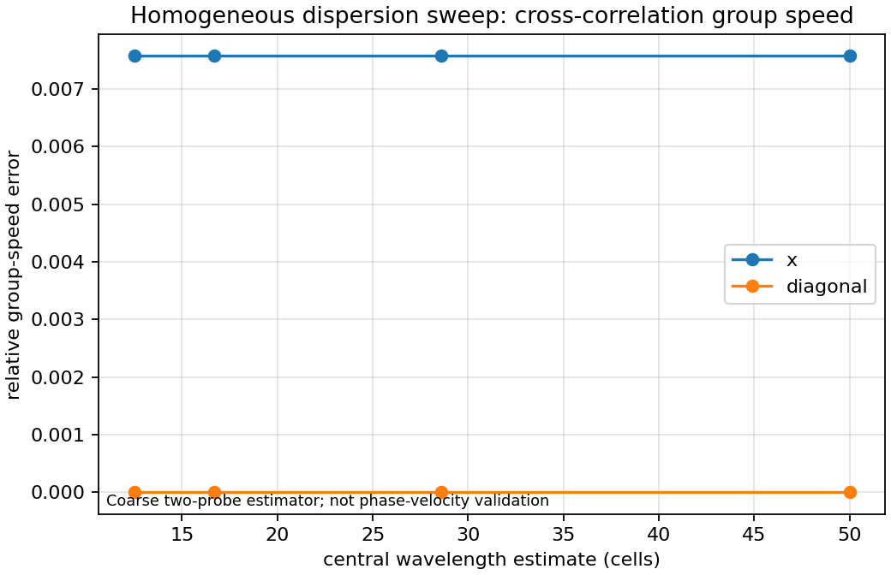

# Dispersion Characterisation

This page summarizes the current CI-friendly dispersion benchmark outputs for
the homogeneous v0.1.1 scalar-wave solver. It does not claim analytical TLM
dispersion agreement and does not cover heterogeneous media.

## Current Benchmark

Command:

```bash
python benchmarks/dispersion_wavelength_sweep.py
```

Output:

- `outputs/benchmarks/dispersion_wavelength_sweep.json`

Current benchmark metrics:

- maximum relative group-speed error: `0.00756943`;
- relative speed spread across the current sweep: `0.00756943`;
- pass criteria:
  - `max_relative_error <= 0.10`;
  - `speed_spread_relative <= 0.04`.

The plot below is generated from the deterministic benchmark JSON.



## Interpretation

The benchmark uses two-probe cross-correlation to estimate group speed for `x`
and diagonal propagation at four Ricker-pulse frequencies. The central
wavelength estimate is `expected_speed / frequency`, expressed in grid cells.

This is useful as a regression and documentation artifact because it records the
current estimator, geometry and tolerances in a machine-readable result file.

## Limitations

- The estimator is a coarse group-speed estimator.
- It does not measure phase velocity.
- It does not prove agreement with an analytical TLM dispersion relation.
- It does not characterize heterogeneous media.
- It does not include PML or external-solver comparison.

Follow-up work should collect analytical TLM dispersion references before making
stronger claims or tightening tolerances.
